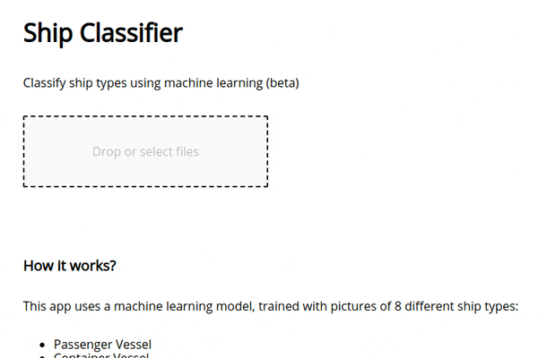

# Ship Classifier 🚢

> Classify ship types using machine learning (beta)

[](https://travis-ci.org/xxczaki/ship-classifier)
[](https://github.com/xojs/xo)
[](https://github.com/styled-components/styled-components)

---



## About

This app uses a machine learning model trained with pictures of 8 different ship types:

- Passenger Vessel
- Container Vessel
- Bulk Vessel
- Roll-on/Roll-off Vessel
- Naval Vessel
- Chemical Tanker
- Sailing Ship
- Submarine

Each learning set contained between 50 and 78 images. The model itself was trained for about 1 minute.

To train the model I used [Teachable Machine](https://teachablemachine.withgoogle.com/), an AI Experiment by Google.

Ship Classifier uses [ml5](https://ml5js.org/), a high-level wrapper around [Tensorflow.js](https://www.tensorflow.org/js)

## Working with the model

If you want to try using the model in your own app, it's available [here](https://github.com/xxczaki/ship-classifier/tree/master/public/model).

In case you would like to train the model yourself, [here](https://ln2.sync.com/dl/956e0cd70/vxkbdr9r-c5cyjkt2-7f5vg3tt-7wqqfpdx) you can download learning sets with sample photos.

As I mentioned earlier, to train the model I used Teachable Machine with the following configuration:

```
Epochs: 150
Batch Size: 16
Learning Rate: 0.00146
```

## Development

> Hosted with [now Δ](https://zeit.com/now)

```
# Install dependencies
$ npm install

# Start in development mode
$ npm run dev

# Build for production
$ npm run build
```


## License

MIT
